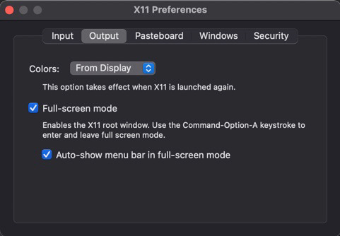
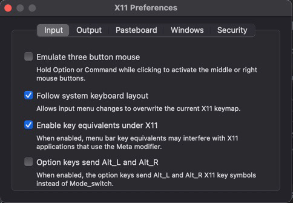

# PCrypt

An esoteric programming language that allows users to encrypt
and decrypt data through image processing.

In other words...

Coding for artists! Users can visualize complicated code
as colored pixel patterns. Images both created with PCrypt or not
can be translated back to data. There is also an option
for users to "draw" with pixels to create an encoded image.

## Build and Run

1. Download code base from GitHub
`git clone https://github.com/kejordan23/PCrypt.git`

   OR download .zip file 

2. Install X11 Server

   For MacOS: 
    
   - Go to https://www.xquartz.org

   - Download and install latest XQuartz version
3. Open Terminal and navigate to PCrypt directory
4. Run following command
`sh PCrypt.sh`

### For best experience
1. Set XQuartz preferences
   
   
2. To take a screenshot
   1. While in XQuartz full screen mode, click the window you 
   want to save.
   2. At the top menu bar, click `Window`, then `Minimize`
   3. At the top menu bar, click `XQuartz`, then `Toggle Full Screen`
   4. Click the minimized image and take a screenshot
      1. For MacOS: `command+shift+4`